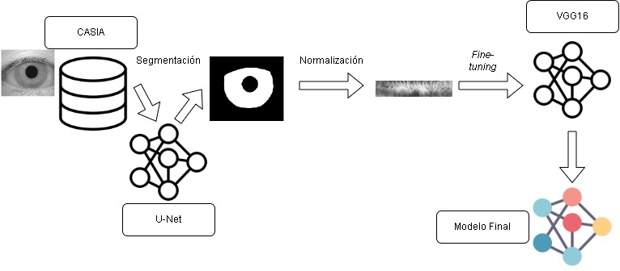
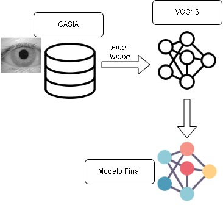

# Clasificación de individuos a partir de imágenes oculares y redes neuronales pre-entrenadas.

###### Clasificación de individuos a partir de imágenes oculares y redes neuronales pre-entrenadas.
Trabajo de fin de máster, del Máster universitario de **Inteligencia de Negocio y *Big-Data* en Entornos Seguros** en las **Universidades de Burgos, León y Valladolid**

Tutores: **Dr. José Francisco Diez Pastor** y **Dr. Pedro Latorre Carmona**

---

Trabajo final de master sobre el reconocimiento y la segmentación del iris, como seguimiento del [Trabajo Final de Grado](https://github.com/jaa0124/iris_classifier) de **Johnson Bolívar Arrobo Acaro**.

# Resumen

La utilización de la biometría para mejorar la seguridad, princi-
palmente en lo referente al acceso de dispositivos electrónicos, es un
recurso ampliamente empleado en la actualidad. El iris es uno de los
elementos biométricos que mayores dificultades presentan para su
suplantación, y por ello, su utilización en este campo ha atraído la
atención de la comunidad científica estas últimas dos décadas.

Las redes neuronales han demostrado ser útiles para extraer
características del iris. Esta extracción se puede llevar a cabo no solo
entrenando una red neuronal desde cero, sino también adaptando una
ya pre-entrenada. Respecto a la utilización de técnicas de adaptación
de la red neuronal se plantean dos preguntas. ¿Es necesario aislar el
iris para llevar a cabo la adaptación de la red neuronal?¿Se puede
aplicar también para conjuntos de datos pequeños?

En este proyecto se han adaptado redes neuronales, inicialmente
entrenadas para clasificar diversos objetos, para que sean capaces de
identificar a un individuo utilizando su imagen ocular.

Para ello, se han utilizado dos enfoques. En un primer enfoque,
las redes neuronales se han adaptado utilizando imágenes oculares
completas, mientras que, para el segundo enfoque, se ha adaptado la
red neuronal con imágenes oculares donde previamente se ha aislado
el iris, ya que a priori, el iris la zona de la imagen ocular que mejor
permite la identificación de individuos.

Además, se han utilizado técnicas de ampliación del dataset ori-
ginal, a fin de contar con un mayor número de muestras de cada
individuo y también, mejorar la robustez de las redes neuronales
adaptadas.

Los resultados muestran que las mejores tasas de clasificación se
han dado en el enfoque donde se utilizaba la imagen ocular completa,
sin que las técnicas de ampliación del dataset hayan permitido mejorar
la tasa de clasificación.
Como futuras líneas de trabajo, se establecen la utilización de
redes neuronales pre-entrenadas distintas, así como testear el modelo
con imágenes realizadas fuera del entorno académico.

### Propuesta con aislamiento de iris

### Propuesta con la imagen completa

---

El template de la memoria se puede encontrar en el siguiente [enlace](https://github.com/bbaruque/plantillaTFM_MUINBDES).
