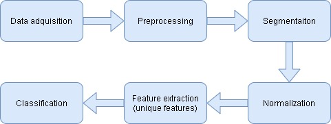

# Sistema de reconocimiento y segmentación del iris

###### Arquitectura *Big Data* de colas para el procesado de vídeo en tiempo real
Trabajo de fin de máster, del Máster universitario de **Inteligencia de Negocio y *Big-Data* en Entornos Seguros** en las **Universidades de Burgos, León y Valladolid**

Tutores: **Dr. José Francisco Diez Pastor** y **Dr. Pedro Latorre Carmona**

---

Trabajo final de master sobre el reconocimiento y la segmentación del iris, como seguimiento del [Trabajo Final de Grado](https://github.com/jaa0124/iris_classifier) de **Johnson Bolívar Arrobo Acaro**.

# Workflow

---

El template de la memoria se puede encontrar en el siguiente [enlace](https://github.com/bbaruque/plantillaTFM_MUINBDES).
